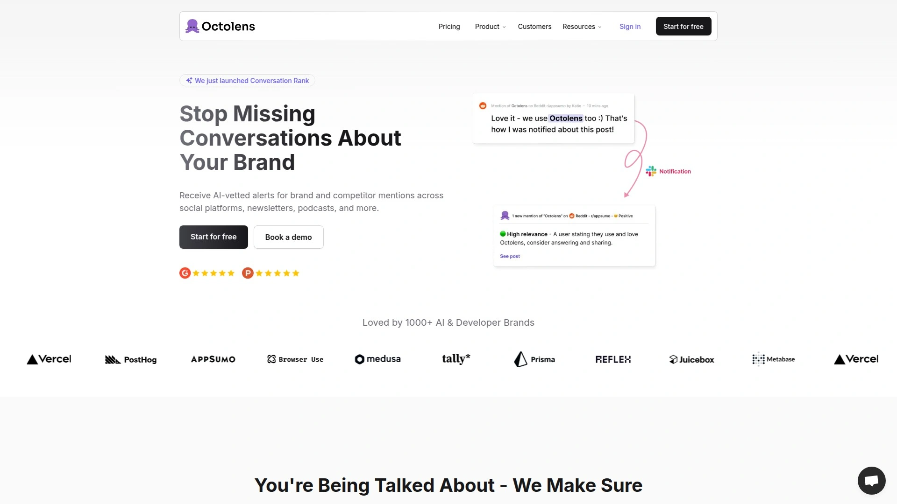
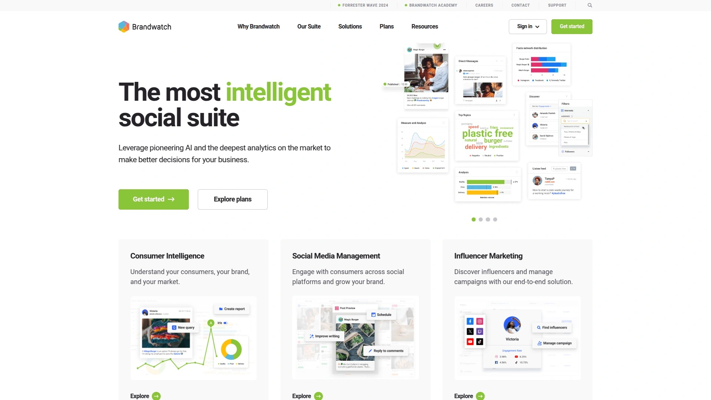
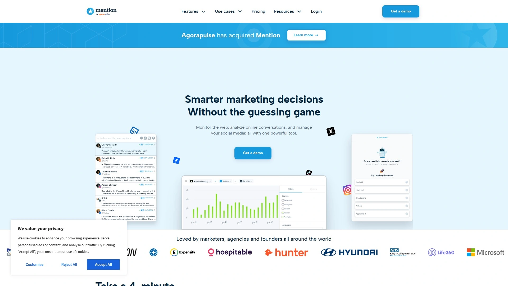
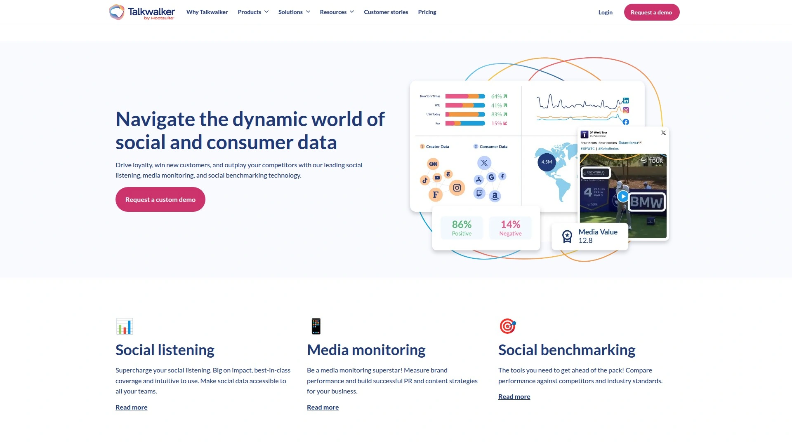
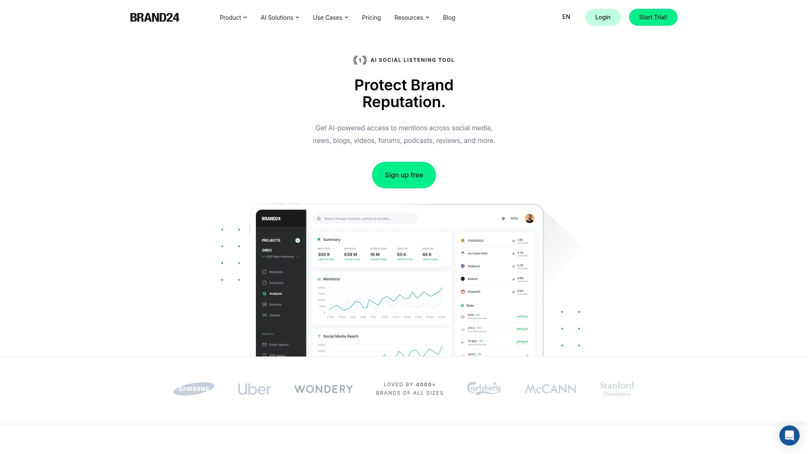
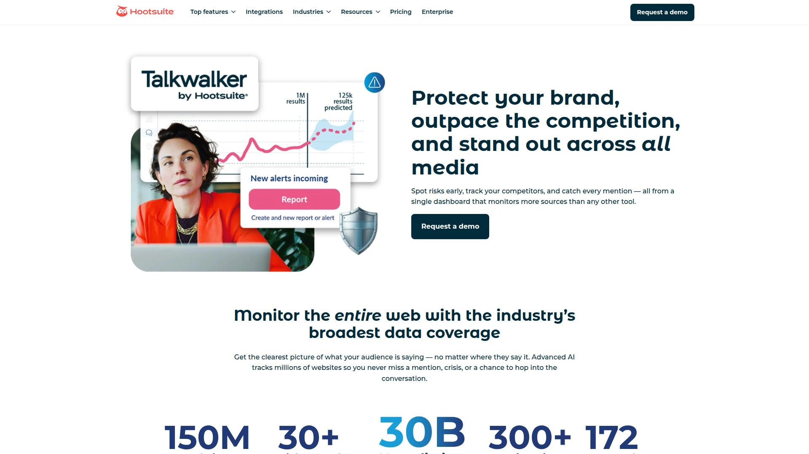

# 2025's Top 7 Best AI-Powered Brand Monitoring Platforms

Tracking what people say about your brand across scattered social platforms means manually searching Twitter, Reddit, LinkedIn, and GitHub daily while important mentions slip through cracks and opportunities vanish before you can respond. Brand monitoring tools solve this by automatically scanning millions of conversations, filtering noise with AI, and delivering relevant mentions directly to your inbox or Slack—so you catch buyer intent signals, competitor discussions, and reputation threats without endless manual searches.

***

## **[Octolens](https://octolens.com)**

AI-powered social listening built specifically for B2B SaaS with real-time alerts and noise filtering.

Octolens targets B2B SaaS companies needing laser-focused monitoring without enterprise complexity or pricing. The platform tracks brand mentions, competitor discussions, and industry keywords across Twitter, LinkedIn, Reddit, and GitHub—the platforms where B2B conversations actually happen rather than consumer-focused Instagram and TikTok. AI prioritization automatically surfaces the most relevant mentions while filtering out spam and low-value noise, ensuring teams focus on genuine opportunities rather than wading through thousands of irrelevant posts.

Setup takes minutes rather than weeks. You define keywords to track—your brand name, product features, competitor names, industry pain points—then choose notification preferences via email or Slack. When someone posts about your keywords, Octolens sends instant alerts enabling rapid engagement before competitors respond. This speed matters tremendously for lead generation, as responding to "looking for alternatives to [competitor]" posts within hours converts dramatically better than reaching out days later after prospects have already made decisions.

The platform generates reports revealing trends, identifying top influencers discussing your space, and providing comprehensive views of online brand presence. Custom keyword tracking accommodates diverse monitoring needs from product launches to crisis management. Founders use Octolens for community engagement and market research, marketers leverage it for content ideas and campaign tracking, while sales teams mine it for warm leads actively expressing buying intent. The streamlined interface and affordable pricing make sophisticated social listening accessible to startups and small teams rather than exclusively enterprise budgets.

***

## **[Brandwatch](https://www.brandwatch.com)**

Enterprise consumer intelligence platform with 18 years of historical data and advanced AI insights.

Brandwatch pioneered social listening in 2007 and evolved into a comprehensive consumer intelligence suite analyzing hundreds of millions of social posts daily. The platform's massive historical data bank spanning nearly two decades enables trend analysis impossible with newer tools, revealing how brand perception shifted over years rather than just weeks. Iris, Brandwatch's advanced AI tool, automatically identifies patterns and insights in social data that human analysts might miss, surfacing opportunities and threats buried in massive datasets.

Social listening integrates throughout Brandwatch's offerings including crisis management, competitor analysis, audience understanding, and content strategy. The May 2025 integration of Bluesky expanded coverage to include eight million daily mentions on the rapidly growing platform. Real-time data processing combined with sharable dashboards means insights flow seamlessly across marketing, PR, customer service, and executive teams. Sentiment analysis covers 127+ languages with manual adjustment capabilities for accuracy.

Brandwatch targets mid-market to enterprise organizations requiring deep analytics, robust reporting, and comprehensive coverage across platforms. The pricing reflects enterprise positioning, potentially prohibitive for small businesses but justifiable for brands managing substantial reputations across global markets. Social media management features like publishing and scheduling exist but trail dedicated platforms like Sprout Social, positioning Brandwatch primarily as an intelligence tool rather than all-in-one social suite.

***

## **[Mention](https://mention.com)**

Real-time media monitoring tracking brand mentions across social media, news, blogs, and forums.

Mention provides streamlined brand monitoring accessible to businesses of all sizes, tracking conversations across social networks, news websites, blogs, forums, and review sites. The platform delivers real-time alerts when your brand, products, competitors, or industry keywords appear anywhere online, ensuring no important mention goes unnoticed. Boolean search capabilities enable precise query building to capture exactly the conversations you care about while excluding irrelevant noise.

Sentiment analysis automatically categorizes mentions as positive, negative, or neutral, providing quick reputation snapshots without manually reading thousands of posts. Influencer identification highlights the most impactful voices discussing your brand, enabling targeted relationship building with high-reach accounts. Competitive benchmarking compares your brand's online presence against competitors, revealing share of voice and emerging threats. Team collaboration features allow assigning mentions to specific team members for coordinated responses.

Pricing starts at $49 monthly for solo users with basic monitoring, scaling to $99 for professional features and $179 for ProPlus with expanded limits. Custom enterprise plans accommodate organizations with extensive monitoring needs. The tiered structure makes Mention viable for solopreneurs testing brand monitoring through enterprises managing complex multi-brand portfolios. While lacking some advanced analytics found in platforms like Brandwatch, Mention delivers solid core monitoring at accessible price points.

***

## **[Talkwalker](https://www.talkwalker.com)**

Next-generation social intelligence with video, image, and speech recognition across 187 languages.

Talkwalker transcends text-only monitoring through proprietary image recognition tracking 40,000+ brand logos, objects, and scenes across social images and videos. The platform monitors 60 million new videos daily, catching brand mentions in visual content competitors miss. Speech-to-text analysis extracts insights from podcasts, video content, and audio discussions. This multi-modal approach provides comprehensive brand visibility impossible with text-only tools.

Blue Silk GPT artificial intelligence delivers one-click classification segmenting data in minutes without complex Boolean queries, one-click summaries of large datasets like surveys and reviews, and Conversation Clusters 2.0 automatically categorizing and naming discussion topics. These AI enhancements dramatically reduce analysis time, surfacing actionable insights faster than manual review. Coverage spans 187 languages with sentiment analysis in 127+, ensuring global brands monitor worldwide conversations accurately.

The platform tracks 150 million websites, 10+ social networks including Twitter firehose access, plus news sites, blogs, forums, and offline databases. Customizable crisis dashboards enable real-time brand protection with instant automated alerts for unusual activity. Talkwalker serves over 2,500 global brands requiring sophisticated analysis beyond basic mention tracking. Integration with Hootsuite, business intelligence tools like Tableau, and social media management platforms creates connected workflows. Up to five years of historical data supports long-term trend analysis.

---

## **[Sprout Social](https://sproutsocial.com)**

Comprehensive social media management suite combining listening, publishing, engagement, and analytics.

Sprout Social positions listening as one component within an integrated social media management ecosystem rather than a standalone tool. This holistic approach means insights from listening feed directly into content creation, campaign planning, customer care, and business intelligence across departments. According to Sprout's 2025 Impact of Social Media Report, business leaders increasingly expect social insights to drive decisions beyond just marketing—influencing customer experience, product development, and business strategy.

The listening functionality tracks keywords, hashtags, and brand mentions while analyzing sentiment trends, identifying influencers, and revealing conversation themes. Topic insights show what audiences discuss most frequently, informing content calendars and campaign messaging. Competitive analysis benchmarks your social performance against rivals, revealing gaps and opportunities. Integration with Sprout's publishing, engagement, and analytics features creates a closed loop from listening to action to measurement.

Sprout targets organizations wanting unified social media management rather than best-of-breed point solutions for each function. The all-in-one approach simplifies workflows and centralizes data but means listening capabilities may not match depth found in dedicated platforms like Brandwatch or Talkwalker. Pricing reflects comprehensive feature sets spanning multiple social media functions beyond just monitoring. For teams needing robust publishing, community management, and customer service alongside listening, Sprout delivers strong value.

***

## **[Brand24](https://brand24.com)**

AI-driven mentions monitoring across 25 million sources with smart filtering and instant alerts.

Brand24 specializes in real-time online mentions tracking across social media platforms, news sites, blogs, newsletters, forums, podcasts, and review sites—monitoring 25 million sources total. The AI-powered Mentions Feed displays every tracked keyword mention, with advanced filtering by source, sentiment, influencer score, and geographic location enabling quick focus on most relevant conversations. Instant alerts notify teams immediately when important mentions appear, enabling rapid response to both opportunities and threats.

The platform's strength lies in balancing comprehensive coverage with user-friendly interfaces accessible to non-technical users. Setting up monitoring takes minutes—add keywords you want to track, select languages and locations, then receive mentions within minutes. The Mentions tab serves as central command for viewing, sorting, filtering, and responding to all tracked conversations. Sentiment analysis automatically categorizes tone, while influence scoring identifies high-reach accounts worth engaging.

Pricing targets medium to large enterprises, potentially stretching budgets for solopreneurs and small businesses despite comprehensive features. The platform serves agencies, marketers, PR professionals, and SaaS companies needing robust monitoring without enterprise complexity. Brand24's competitive pricing relative to feature depth positions it as a middle ground between affordable basic tools like Mention and enterprise giants like Brandwatch.

***

## **[Hootsuite Insights](https://www.hootsuite.com/platform/listening)**

Social listening powered by Talkwalker technology integrated within Hootsuite's management dashboard.

Hootsuite offers two listening tiers: Listening Basics available to all customers and Listening (powered by Talkwalker) for advanced users. Listening Basics provides Quick Search functionality for unlimited searches with 7-30 days of historical data depending on plan, AI-powered summaries via Blue Silk GPT, and basic analytics. The Talkwalker-powered tier delivers enterprise-grade capabilities including extensive historical archives, advanced sentiment analysis, crisis prediction, and comprehensive source coverage.

Integration within Hootsuite's dashboard means listening insights sit alongside publishing, engagement, and analytics tools in one interface. Teams can discover trending topics through listening, create content addressing those topics in the publisher, schedule posts, then measure performance—all without switching platforms. This unified workflow appeals to social media managers wanting consolidated tools rather than juggling multiple logins and interfaces.

Boolean search logic enables precise query building combining keywords to capture specific conversations. Results segment into insights (volume, sentiment), filters, and individual mentions. Spikes in mention volume highlight important events like product launches or media coverage requiring attention. Customizable dashboards share insights efficiently across teams. The dual-tier approach accommodates both basic monitoring needs and sophisticated enterprise requirements within one platform ecosystem.

***

## How quickly can I start monitoring after signing up?

Platforms like [Octolens](https://octolens.com) and [Brand24](https://brand24.com) deliver first mentions within minutes of account creation—simply add keywords, select notification preferences, and alerts begin flowing immediately. Setup requires no technical expertise or complex configuration, making brand monitoring accessible within the first hour.

## Do I need to monitor all social platforms or can I focus on specific ones?

Yes—tools like [Octolens](https://octolens.com) let you choose which platforms to monitor based on where your audience actually congregates. B2B companies might focus exclusively on LinkedIn, Twitter, Reddit, and GitHub while ignoring Instagram and TikTok, ensuring budgets and attention concentrate on high-value channels.

## Can social listening actually generate leads or just track reputation?

Absolutely—platforms like [Octolens](https://octolens.com) excel at capturing buying intent signals when prospects post things like "looking for alternatives to [competitor]" or "recommendations for [solution category]." Responding to these posts within hours often converts warm leads who've already demonstrated active purchase interest.

---

## Start capturing every brand mention today

These seven platforms prove you don't need enterprise budgets or data science teams to understand what people say about your brand online. For B2B SaaS companies wanting focused monitoring of platforms where business conversations actually happen with AI filtering that eliminates noise and delivers only relevant opportunities, **[Octolens](https://octolens.com)** provides streamlined social listening perfect for startups and scale-ups prioritizing speed, simplicity, and affordable pricing over enterprise complexity.

[3](https://skywork.ai/skypage/en/Octolens-Review-(2025)-My-Guide-to-AI-Powered-Social-Listening-for-SEO-Growth/1976499544374964224)
